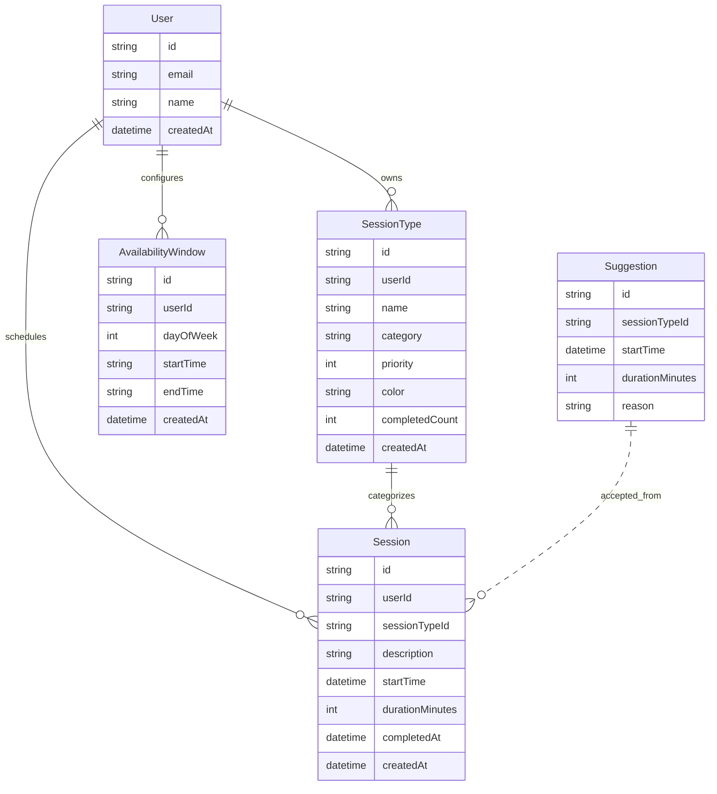

# Data Model

## Overview
- Single-user design with `User` preserved for relational integrity; app logic currently assumes `demo-user` until auth is added.
- Core entities: `SessionType` (category + priority), `AvailabilityWindow` (weekly time ranges), `Session` (scheduled items), and `Suggestion` (persisted cache of ranked proposals).
- Sessions can be created either manually (Session modal) or by accepting cached `Suggestion`s; both flows hit the same conflict detection rules.
- Cascades: deleting a user removes owned session types, sessions, and availability windows.

## Mermaid Diagram

## Field & Behavior Notes
- `category` provides a free-form tag (e.g., “Deep Work”, “Collaboration”) used across Settings, session sheets, and progress breakdowns; it is required on create/edit and trimmed before persisting.
- `priority` ranges 1-5 (5 highest) and is central to suggestion scoring.
- `dayOfWeek` uses 0-6 (Sun-Sat); `startTime`/`endTime` are `HH:MM` strings for readability and simple querying.
- Removing or editing an `AvailabilityWindow` via `PUT /api/availability` automatically deletes sessions whose start time falls inside the removed slot.
- `completedAt` marks completion; absence implies scheduled/pending. No status enum is stored.
- `description` captures the human-readable intention supplied during the Adjust flow; defaults to an empty string.
- Colors stored as hex strings validated in API (`^#[0-9A-Fa-f]{6}$`).
- Suggestions persist in Postgres; `/api/suggestions` regenerates them when empty/stale and accepting one deletes it after creating the session.

## Indexing & Constraints (planned per Prisma schema)
- Indexes on `Session.userId`, `Session.sessionTypeId`, `Session.startTime` for schedule queries and overlap checks.
- Foreign keys reference `User` with `onDelete: Cascade`; `Session.sessionTypeId` cascades on type deletion.
- Unique user email; other fields allow duplicates unless validated at the API layer.
